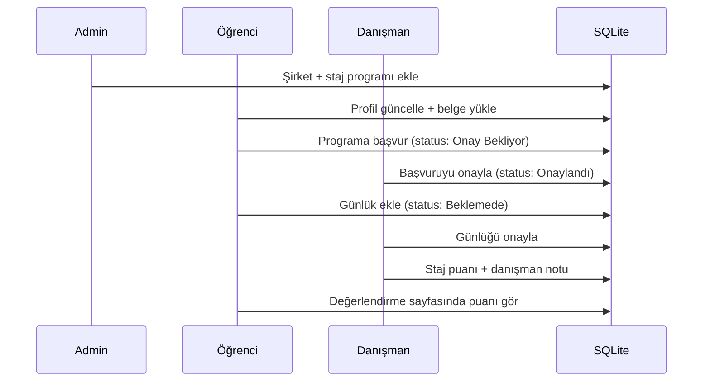

# StajFlow — Proje Analiz Raporu

> **Analiz tarihi:** 2 Haziran 2026  
> **Repo:** [github.com/sl-kl3/StajFlow](https://github.com/sl-kl3/StajFlow)  
> **Analiz kapsamı:** Kaynak kod, şablonlar, veritabanı, güvenlik, mimari ve kalite değerlendirmesi

---

## Proje Özeti

### Proje ne yapıyor?

**StajFlow**, üniversite öğrencilerinin staj süreçlerini uçtan uca takip eden bir web uygulamasıdır. Öğrenciler staj ilanlarına başvurur, günlük tutar ve profil/belge yükler; danışman hocalar başvuruları ve günlükleri onaylar, staj puanı verir; admin kullanıcıları, şirketleri ve ilanları yönetir.

### Hangi problemi çözüyor?

Üniversitelerde staj başvurusu, onay, günlük takibi ve değerlendirme süreçleri genellikle e-posta, Excel veya kağıt formlarla yürütülür. StajFlow bu süreci tek bir dijital panelde toplar:

- Staj ilanı yayınlama ve kontenjan yönetimi
- Öğrenci başvurusu ve durum takibi
- Danışman onay akışı
- Staj günlüğü ve saat kaydı
- Danışman puanlama ve geri bildirim

### Hedef kullanıcı kitlesi

| Rol | Kim? | Ne yapar? |
|-----|------|-----------|
| **Öğrenci** | Staj yapacak BM/Mühendislik öğrencisi | Profil doldurur, ilana başvurur, günlük yazar |
| **Danışman** | Akademik danışman / öğretim üyesi | Başvuru ve günlük onaylar, puan verir |
| **Admin** | Bölüm / staj koordinatörü | Kullanıcı, şirket, ilan yönetimi; rapor görüntüleme |

---

## Teknoloji Yığını

### Backend

| Teknoloji | Sürüm | Kullanım |
|-----------|-------|----------|
| **Python** | 3.x | Ana dil |
| **Flask** | ≥ 3.0 | Web framework, routing, template render |
| **Flask-Login** | ≥ 0.6.3 | Oturum yönetimi, `@login_required` |
| **Flask-SQLAlchemy** | ≥ 3.1 | ORM, SQLite bağlantısı |
| **Werkzeug** | ≥ 3.0 | Şifre hash, dosya güvenliği (`secure_filename`) |

### Frontend

| Teknoloji | Kullanım |
|-----------|----------|
| **Jinja2** | Sunucu taraflı HTML şablonları |
| **CSS** (`static/css/style.css`) | Özel tasarım, responsive layout |
| **Tabler Icons** (CDN) | İkon seti |
| **Google Fonts** (Outfit, DM Sans) | Tipografi |

> **Not:** React, Vue veya ayrı bir SPA yok. Tüm UI sunucu tarafında render edilir.

### Veritabanı

| Özellik | Değer |
|---------|-------|
| Motor | **SQLite** |
| Dosya | `instance/stajflow.db` |
| ORM | SQLAlchemy modelleri (`models.py`) |
| Migrasyon | Resmi Alembic yok; `db_seed._ensure_columns()` ile manuel ALTER |

### Ortam değişkenleri

| Değişken | Varsayılan | Açıklama |
|----------|------------|----------|
| `SECRET_KEY` | `stajflow_full_power_123` | Flask oturum imzası |
| `DATABASE_URL` | `sqlite:///instance/stajflow.db` | DB bağlantı URI |
| `UNIVERSITY_NAME` | `Üniversite Staj Yönetim Sistemi` | Kurum adı (header/sidebar) |

### Dosya yükleme

- Klasör: `instance/uploads/`
- Maks boyut: 16 MB (`MAX_CONTENT_LENGTH`)
- İzin verilen uzantılar: `pdf, png, jpg, jpeg, doc, docx`

---

## Sistem Mimarisi

### Genel yapı

```
┌─────────────────────────────────────────────────────────────┐
│                        Tarayıcı (Client)                     │
│              HTML formları + CSS + Tabler Icons              │
└──────────────────────────┬──────────────────────────────────┘
                           │ HTTP (GET/POST)
                           ▼
┌─────────────────────────────────────────────────────────────┐
│                     Flask (app.py)                           │
│  ┌─────────────┐  ┌──────────────┐  ┌─────────────────────┐ │
│  │ Auth Layer  │  │ Role Guard   │  │ Route Handlers      │ │
│  │ Flask-Login │  │ role_required│  │ (tek dosyada ~700 sat)│ │
│  └─────────────┘  └──────────────┘  └─────────────────────┘ │
└──────────────────────────┬──────────────────────────────────┘
                           │ SQLAlchemy ORM
                           ▼
┌─────────────────────────────────────────────────────────────┐
│              SQLite (instance/stajflow.db)                   │
│   User | University | Company | InternshipProgram | ...      │
└─────────────────────────────────────────────────────────────┘
                           │
                           ▼
┌─────────────────────────────────────────────────────────────┐
│              Dosya sistemi (instance/uploads/)               │
└─────────────────────────────────────────────────────────────┘
```

### Katmanlar

| Katman | Dosya(lar) | Sorumluluk |
|--------|------------|------------|
| **Sunum** | `templates/`, `static/` | HTML, CSS, kullanıcı arayüzü |
| **Uygulama** | `app.py` | Routing, iş kuralları, yetkilendirme |
| **Veri** | `models.py` | ORM modelleri, ilişkiler |
| **Seed / Migrasyon** | `db_seed.py`, `setup_db.py` | Demo veri, şema güncelleme |
| **Kalıcı depolama** | `instance/` | SQLite DB + yüklenen belgeler |

### Veri akışı (tipik staj döngüsü)



### REST API durumu

**Ayrı bir REST/JSON API yok.** Tüm etkileşim HTML form POST + redirect modeliyle yapılır. Bu, öğrenci projesi için yeterli; mobil entegrasyon veya harici sistemler için sınırlayıcıdır.

---

## Klasör Yapısı Analizi

```
stajflow/
├── app.py                 # Ana uygulama: tüm route'lar ve iş mantığı
├── models.py              # SQLAlchemy modelleri (7 tablo)
├── db_seed.py             # Demo kullanıcılar, şirketler, şema migrasyonu
├── setup_db.py            # DB sıfırlama scripti (sunum öncesi)
├── requirements.txt       # Python bağımlılıkları
├── README.md              # Kurulum ve demo hesaplar
├── PROJECT_ANALYSIS.md    # Bu dosya
├── .gitignore             # instance/, __pycache__, .env hariç tutulur
├── .gitattributes         # Satır sonu normalizasyonu (LF)
├── static/
│   └── css/
│       └── style.css      # Tüm UI stilleri (~600+ satır)
├── templates/
│   ├── base.html          # Sidebar + header shell
│   ├── login.html         # Giriş sayfası
│   ├── ogrenci/           # 5 öğrenci sayfası
│   ├── danisman/          # 4 danışman sayfası
│   └── admin/             # 5 admin sayfası
└── instance/              # Git'e gitmez — runtime'da oluşur
    ├── stajflow.db        # SQLite veritabanı
    └── uploads/           # Öğrenci belgeleri
```

### Dosya görevleri

| Dosya | Satır (yaklaşık) | Görev |
|-------|------------------|-------|
| `app.py` | ~720 | Monolitik controller: auth, CRUD, upload, role guard |
| `models.py` | ~100 | 7 entity: University, User, StudentDocument, Company, InternshipProgram, Internship, DailyLog |
| `db_seed.py` | ~200 | ROLE_MAP, demo kullanıcılar, `_ensure_columns()` SQLite migrasyonu |
| `setup_db.py` | ~16 | `drop_all()` + yeniden seed (sunum/demo reset) |

---

## Sayfa ve Panel Analizi

### Ortak bileşenler

- **`base.html`:** Rol bazlı sidebar menüsü, kurum adı, kullanıcı avatarı, flash mesajları
- **`login.html`:** E-posta/şifre girişi; demo hesap bilgileri gösterilir

### Öğrenci paneli (`/ogrenci/...`)

| Route | Şablon | Amaç | Kullanıcı akışı |
|-------|--------|------|-----------------|
| `GET /ogrenci` | `ogrenci/anasayfa.html` | Dashboard: istatistikler, profil formu, belge yükleme | Giriş → profil doldur → belge yükle |
| `POST /ogrenci/profil` | — | Profil alanları + 4 belge tipi kaydet | Form gönder → flash mesaj |
| `GET /ogrenci/ilanlar` | `ogrenci/ilanlar.html` | Aktif staj ilanları listesi | İlan seç → başvur |
| `GET /ogrenci/basvurularim` | `ogrenci/basvurularim.html` | Geçmiş ve aktif başvurular | Durum takibi |
| `GET /ogrenci/gunluk` | `ogrenci/gunluk.html` | Günlük listesi + yeni günlük formu | Onaylı staj varsa günlük ekle |
| `GET /ogrenci/degerlendirme` | `ogrenci/degerlendirme.html` | Puanlanmış staj + günlük durumları | Danışman puanını gör |

### Danışman paneli (`/danisman/...`)

| Route | Şablon | Amaç |
|-------|--------|------|
| `GET /danisman` | `danisman/anasayfa.html` | Özet istatistikler (bekleyen başvuru/günlük) |
| `GET /danisman/basvurular` | `danisman/basvuru-onay.html` | Onay bekleyen başvurular |
| `GET /danisman/gunluk` | `danisman/gunluk-onay.html` | Onay bekleyen günlükler |
| `GET /danisman/puanlama` | `danisman/puanlama.html` | Onaylanmış stajlara puan verme |

### Admin paneli (`/admin/...`)

| Route | Şablon | Amaç |
|-------|--------|------|
| `GET /admin` | `admin/anasayfa.html` | Dashboard + son 20 başvuru |
| `GET /admin/ogrenciler` | `admin/ogrenciler.html` | Kullanıcı listesi, ekleme/silme |
| `GET /admin/basvurular` | `admin/basvurular.html` | Tüm staj başvuruları |
| `GET /admin/sirketler` | `admin/sirketler.html` | Şirket + program yönetimi |
| `GET /admin/raporlar` | `admin/raporlar.html` | Özet istatistik raporu |

---

## API Analizi (Route / Endpoint)

> Proje klasik web uygulamasıdır; JSON API yoktur. Aşağıdaki tablo tüm HTTP endpoint'leri listeler.

### Genel

| Method | Path | Yetki | Amaç | Girdi | Çıktı |
|--------|------|-------|------|-------|-------|
| GET | `/` | Herkes | Oturum varsa dashboard'a yönlendir | — | 302 |
| GET/POST | `/login` | Herkes | Giriş | email, password | HTML / 302 |
| GET | `/logout` | Giriş yapmış | Çıkış | — | 302 |
| GET | `/dashboard` | Giriş yapmış | Role göre ana sayfa | — | 302 |
| GET | `/uploads/<filename>` | Giriş yapmış | Belge indirme | filename | Dosya / 403/404 |

### Öğrenci action'ları

| Method | Path | Girdi | İş kuralı |
|--------|------|-------|-----------|
| POST | `/ogrenci/profil` | gpa, graduated_school, department, experience, foreign_language, phone, cv/diploma/certificate/other dosyaları | GANO 0–4 doğrulama; belge tipi kontrolü |
| POST | `/apply_program/<id>` | — | Aktif başvuru yoksa; kontenjan > 0; şirket aktif |
| POST | `/add_log` | content, hours (1–12) | Onaylanmış staj gerekli |

### Danışman action'ları

| Method | Path | Girdi | İş kuralı |
|--------|------|-------|-----------|
| POST | `/action/apply/<id>/ok\|no` | — | Onayla / reddet |
| POST | `/action/log/<id>/ok\|no` | — | Günlük onayla / reddet |
| POST | `/action/score/<id>` | score (0–100), advisor_note | Sadece `Onaylandı` statüsündeki stajlar |

### Admin action'ları

| Method | Path | Girdi | İş kuralı |
|--------|------|-------|-----------|
| POST | `/admin/add_user` | name, email, password, role, student_no, department | E-posta benzersiz |
| POST | `/admin/delete_user/<id>` | — | Kendini silemez; ilişkili kayıt + dosya temizliği |
| POST | `/admin/add_company` | name, sector, contact, address | İsim zorunlu |
| POST | `/admin/add_program` | company_id, title, description, type, start, end, quota | Şirket + başlık zorunlu |
| POST | `/admin/toggle_program/<id>` | — | Aktif/pasif toggle |

---

## Veritabanı Analizi

### ER diyagramı (mantıksal)

```
University 1───* User
User 1───* Internship
User 1───* DailyLog
User 1───* StudentDocument
Company 1───* InternshipProgram
InternshipProgram 1───* Internship
```

### Tablolar

#### `university`
| Sütun | Tip | Amaç |
|-------|-----|------|
| id | INTEGER PK | |
| name | VARCHAR(150) | Kurum tam adı |
| short_name | VARCHAR(40) | Kısa ad |
| domain | VARCHAR(80) | E-posta domaini |
| city | VARCHAR(80) | Şehir |
| is_active | BOOLEAN | Aktif kurum |

#### `user`
| Sütun | Tip | Amaç |
|-------|-----|------|
| id | INTEGER PK | |
| email | VARCHAR(120) UNIQUE | Giriş kimliği |
| password | VARCHAR(200) | Werkzeug hash |
| name | VARCHAR(100) | Ad soyad |
| student_no | VARCHAR(20) | Öğrenci numarası |
| department | VARCHAR(100) | Bölüm |
| role | VARCHAR(20) | ogrenci / danisman / admin |
| university_id | FK → university | Kurum bağlantısı |
| title | VARCHAR(100) | Unvan (danışman) |
| gpa | FLOAT | GANO |
| graduated_school | VARCHAR(150) | Mezun olunan okul |
| experience | TEXT | Deneyim |
| foreign_language | VARCHAR(120) | Yabancı dil |
| phone | VARCHAR(30) | Telefon |

#### `student_document`
| Sütun | Tip | Amaç |
|-------|-----|------|
| id | INTEGER PK | |
| student_id | FK → user | |
| doc_type | VARCHAR(30) | cv / diploma / certificate / other |
| filename | VARCHAR(200) | Diskteki güvenli ad |
| original_name | VARCHAR(200) | Orijinal dosya adı |
| uploaded_at | DATETIME | Yükleme zamanı |

#### `company`
| Sütun | Tip | Amaç |
|-------|-----|------|
| id | INTEGER PK | |
| name | VARCHAR(120) | Şirket adı |
| sector | VARCHAR(80) | Sektör |
| contact | VARCHAR(120) | İletişim |
| address | VARCHAR(200) | Adres |
| is_active | BOOLEAN | Aktif mi |

#### `internship_program`
| Sütun | Tip | Amaç |
|-------|-----|------|
| id | INTEGER PK | |
| company_id | FK → company | |
| title | VARCHAR(150) | İlan başlığı |
| description | TEXT | Açıklama |
| internship_type | VARCHAR(50) | Zorunlu / Gönüllü |
| start_date | VARCHAR(50) | Başlangıç (string!) |
| end_date | VARCHAR(50) | Bitiş |
| quota | INTEGER | Kontenjan |
| is_active | BOOLEAN | Yayında mı |
| created_at | DATETIME | Oluşturulma |

#### `internship` (başvuru kaydı)
| Sütun | Tip | Amaç |
|-------|-----|------|
| id | INTEGER PK | |
| student_id | FK → user | |
| program_id | FK → internship_program | |
| company_name | VARCHAR(100) | Snapshot (program silinse bile kalır) |
| internship_type | VARCHAR(50) | |
| start_date, end_date | VARCHAR(50) | Snapshot |
| description | TEXT | |
| status | VARCHAR(20) | Onay Bekliyor / Onaylandı / Reddedildi |
| score | INTEGER | Danışman puanı (0–100) |
| advisor_note | TEXT | Danışman notu |
| created_at | DATETIME | |

#### `daily_log`
| Sütun | Tip | Amaç |
|-------|-----|------|
| id | INTEGER PK | |
| student_id | FK → user | |
| student_name | VARCHAR(100) | Denormalize (liste hızı için) |
| date | DATETIME | Kayıt tarihi |
| content | TEXT | Günlük metni |
| hours | INTEGER | Çalışılan saat (1–12) |
| status | VARCHAR(20) | Beklemede / Onaylandı / Reddedildi |

### Tasarım notları

- **Snapshot pattern:** `Internship` tablosunda şirket/program bilgisi kopyalanır — program değişse bile başvuru geçmişi korunur. İyi pratik.
- **String tarihler:** `start_date` / `end_date` VARCHAR olarak tutulur; sıralama ve doğrulama zayıf.
- **Denormalizasyon:** `DailyLog.student_name` tekrarlı veri; öğrenci adı değişince eski günlüklerde eski ad kalır.

---

## Kod Akış Haritası

### Uygulama başlatma

```
app.py import
  → Flask app oluştur
  → db.init_app(app)
  → login_manager kur
  → with app.app_context(): init_database(app)
       → db.create_all()
       → _ensure_columns()      # SQLite ALTER
       → seed_university()
       → ensure_demo_users()    # Demo şifreleri her seferinde reset
       → seed_sirketler()
  → os.makedirs(upload_path)
```

### Yetkilendirme akışı

```
Request
  → @login_required (Flask-Login)
  → @role_required('ogrenci'|'danisman'|'admin')
       → normalize_role(current_user.role)
       → yetkisiz → flash + role_home() redirect
  → view function
```

### Kritik iş kuralları (`app.py`)

| Fonksiyon | Konum | Kural |
|-----------|-------|-------|
| `active_internship()` | satır 80–86 | Öğrencinin `Onay Bekliyor` veya `Onaylandı` başvurusu |
| `program_slots_left()` | satır 89–93 | Kontenjan − aktif başvuru sayısı |
| `role_required()` | satır 55–68 | Decorator tabanlı RBAC |
| `save_document()` | satır 113–138 | Dosya doğrulama, eski dosya silme, DB kaydı |

### Bağımlılık grafiği

```
app.py
 ├── models.py (db, tüm modeller)
 ├── db_seed.py (init_database, normalize_role, is_danisman)
 └── werkzeug (hash, secure_filename)

db_seed.py
 └── models.py

setup_db.py
 ├── app.py (app context)
 └── db_seed.py (seed fonksiyonları)

templates/*.html
 └── base.html (extend)
```

---

## Tespit Edilen Problemler

### Kritik / Yüksek risk

| # | Sorun | Konum | Risk | Açıklama |
|---|-------|-------|------|----------|
| 1 | **CSRF koruması yok** | Tüm POST formları | 🔴 Yüksek | Oturum açıkken sahte form gönderimi mümkün. Production için Flask-WTF veya CSRF token şart. |
| 2 | **Varsayılan SECRET_KEY kaynak kodda** | `app.py:21` | 🔴 Yüksek | `stajflow_full_power_123` — oturum çerezi tahmin edilebilir. Ortam değişkeni zorunlu olmalı. |
| 3 | **debug=True production'da** | `app.py:718` | 🔴 Yüksek | Hata ayıklama modu stack trace sızdırır. |
| 4 | **Demo şifreleri her başlatmada reset** | `db_seed.ensure_demo_users()` | 🟡 Orta | Demo hesaplar için kasıtlı; gerçek kullanıcı şifreleri etkilenmez ama tasarım kafa karıştırıcı. |

### Orta risk

| # | Sorun | Konum | Risk | Açıklama |
|---|-------|-------|------|----------|
| 5 | **Monolitik app.py (~720 satır)** | `app.py` | 🟡 Orta | Blueprint/service ayrımı yok; SRP ihlali, test zorluğu. |
| 6 | **init_database import side-effect** | `app.py:712–714` | 🟡 Orta | `import app` her seferinde DB işlemi yapar; test ve CLI'da sorun çıkarabilir. |
| 7 | **Danışman tüm upload'lara erişebilir** | `uploaded_file()` | 🟡 Orta | Düzeltildi (danışman erişimi eklendi) — bilinçli tasarım ama scope kontrolü yok (hangi öğrencinin belgesi). |
| 8 | **Tarih alanları string** | `models.py` | 🟡 Orta | ISO date validation yok; sıralama/filtreleme güvenilmez. |
| 9 | **Race condition kontenjanda** | `apply_program()` | 🟡 Orta | Eşzamanlı iki başvuruda kontenjan aşılabilir (SQLite + transaction yok). |

### Düşük risk / Kod kalitesi

| # | Sorun | Konum | Risk | Açıklama |
|---|-------|-------|------|----------|
| 10 | **can_apply dead code** | `ogrenci_ilanlar()` | 🟢 Düşük | `apply.status == 'Reddedildi'` hiç true olmaz (`active_internship` reddedileni döndürmez). |
| 11 | **degerlendirme sadece puanlı staj** | `ogrenci_degerlendirme()` | 🟢 Düşük | Puanlanmamış onaylı staj görünmez. |
| 12 | **DailyLog.student_name denormalize** | `models.py` | 🟢 Düşük | Ad değişince tutarsızlık. |
| 13 | **Unit test yok** | — | 🟢 Düşük | Regresyon riski yüksek. |
| 14 | **setup_db upload klasörünü temizlemez** | `setup_db.py` | 🟢 Düşük | DB sıfırlansa bile eski dosyalar kalabilir. |

### SOLID / Clean Code ihlalleri

| Prensip | İhlal | Kanıt |
|---------|-------|-------|
| **SRP** | `app.py` auth + CRUD + upload + stats + routing | Tek dosyada 30+ route |
| **OCP** | Yeni rol eklemek için `base.html` + `app.py` + `role_home()` değişmeli | Dağınık role switch |
| **DIP** | Doğrudan ORM sorguları view içinde | Service/repository katmanı yok |
| **DRY** | `admin_stats()` ve danışman home benzer sayımlar | Tekrarlı query pattern |

---

## Yapılan İyileştirmeler

Bu analiz oturumunda aşağıdaki düzeltmeler uygulandı:

| Dosya | Değişiklik | Neden |
|-------|------------|-------|
| `app.py` | `save_document()` eski dosyayı diskten siler; bool döner | Orphan dosya birikimini önler |
| `app.py` | `uploaded_file()` path traversal koruması (`basename`); dosya varlık kontrolü; danışman erişimi | Güvenlik + danışman belge inceleme |
| `app.py` | `ogrenci_profil()` GANO 0–4 doğrulama; upload ön kontrolü; rollback | Geçersiz veri ve kısmi kayıt önleme |
| `app.py` | `action_score()` sadece `Onaylandı` stajları puanlar | Mantık hatası önleme |
| `app.py` | `admin_delete_user()` fiziksel belge dosyalarını siler | Disk sızıntısı önleme |
| `db_seed.py` | Demo `graduated_school` → `Önlisans - Bilgisayar Programcılığı` | UI placeholder ile tutarlılık |

### Test sonuçları

Tüm rol route'ları Flask test client ile doğrulandı (200/302):

- Admin: `/admin`, `/admin/ogrenciler`, `/admin/basvurular`, `/admin/sirketler`, `/admin/raporlar`
- Danışman: `/danisman`, `/danisman/basvurular`, `/danisman/gunluk`, `/danisman/puanlama`
- Öğrenci: `/ogrenci`, `/ogrenci/ilanlar`, `/ogrenci/basvurularim`, `/ogrenci/gunluk`, `/ogrenci/degerlendirme`

---

## Gelecekte Yapılabilecek İyileştirmeler

### Ölçeklenebilirlik

1. **Blueprint ayrımı:** `auth`, `ogrenci`, `danisman`, `admin` blueprint'leri
2. **PostgreSQL geçişi:** Production için SQLite yerine PostgreSQL + connection pool
3. **Alembic migrasyon:** `_ensure_columns()` yerine versiyonlu şema yönetimi
4. **Service katmanı:** İş kurallarını view'dan ayır (`InternshipService`, `DocumentService`)

### Güvenlik

1. **Flask-WTF CSRF** tüm formlara
2. **`SECRET_KEY` zorunlu** — varsayılan key ile başlatmayı reddet
3. **Rate limiting** login endpoint'inde (Flask-Limiter)
4. **Upload scope:** Danışman sadece kendi öğrencilerinin belgelerine erişsin
5. **HTTPS + secure cookie** flags production'da
6. **`debug=False`** ve WSGI sunucu (Gunicorn/waitress)

### Performans

1. **N+1 query:** Template'lerde lazy relationship yerine eager load (`joinedload`)
2. **admin_stats()** tek aggregate query ile
3. **University.query.first()** context processor'da cache (request scope)
4. **Pagination:** Admin listelerinde LIMIT/OFFSET

### Kalite

1. **pytest** ile route ve iş kuralı testleri
2. **Type hints** modeller ve servislerde
3. **Logging** yapılandırması (dosya + seviye)
4. **Email bildirimleri** (başvuru onayı, günlük reddi)

---

## Son Değerlendirme

### Kalite puanı: **6.8 / 10**

| Kriter | Puan | Gerekçe |
|--------|------|---------|
| İşlevsellik | 8/10 | Üç rol, tam staj döngüsü, belge yükleme çalışıyor |
| Kod organizasyonu | 5/10 | Monolitik yapı, katman ayrımı yok |
| Güvenlik | 4/10 | CSRF yok, default secret, debug mode |
| Veritabanı tasarımı | 7/10 | İlişkiler mantıklı; string tarih zayıf |
| UI/UX | 7.5/10 | Modern CSS, rol bazlı menü, responsive |
| Test / CI | 3/10 | Otomatik test yok |
| Dokümantasyon | 7/10 | README + bu analiz yeterli |

### Teknik borç seviyesi: **Orta–Yüksek**

- Monolitik controller (~720 satır)
- Manuel SQLite migrasyon
- Güvenlik eksikleri (CSRF, secret)
- Test altyapısı yok

### Production hazırlığı: **~45%**

| Hazır | Eksik |
|-------|-------|
| ✅ Temel iş akışları | ❌ CSRF koruması |
| ✅ Rol bazlı erişim | ❌ Production WSGI |
| ✅ Şifre hash | ❌ Güvenli SECRET_KEY zorunluluğu |
| ✅ Dosya upload doğrulama | ❌ HTTPS / secure cookies |
| ✅ Demo veri / reset script | ❌ Otomatik testler |
| ✅ .gitignore (instance, secrets) | ❌ PostgreSQL / backup |
| | ❌ Logging / monitoring |
| | ❌ Rate limiting |

**Sunum / demo ortamı için:** %90+ hazır — `setup_db.py` + demo hesaplar yeterli.  
**Gerçek üniversite deployment için:** Güvenlik ve altyapı iyileştirmeleri şart.

---

*Bu rapor kaynak kodun doğrudan incelenmesiyle oluşturulmuştur; varsayım yapılmamış, tespitler dosya/satır referanslarıyla desteklenmiştir.*
